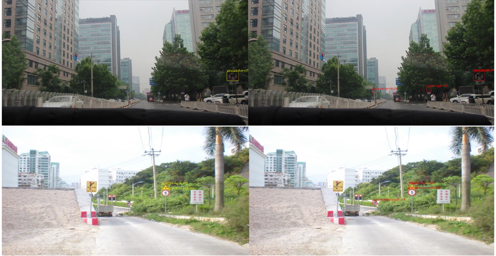

# A Cascaded R-CNN With Multiscale Attention and Imbalanced Samples for Traffic Sign Detection
Traffic sign detection, convolutional neural network, attention, object detection, Multiscale:

> [**Traffic Sign Detection**](https://ieeexplore.ieee.org/abstract/document/8986614)     

## Abstract 

In recent years, the deep learning is applied to the field of traffic sign detection methods which achieves excellent performance. However, there are two main challenges in traffic sign detection to be solve urgently. For one thing, some traffic signs of small size are more difficult to detect than those of large size so that the small traffic signs are undetected. For another, some false signs are always detected because of interferences caused by the illumination variation, bad weather and some signs similar to the true traffic signs. Therefore, to solve the undetection and false detection, we first propose a cascaded R-CNN to obtain the multiscale features in pyramids. Each layer of the cascaded network except the first layer fuses the output bounding box of the previous one layer for joint training. This method contributes to the traffic sign detection. Then, we propose a multiscale attention method to obtain the weighted multiscale features by dot-product and softmax, which is summed to fine the features to highlight the traffic sign features and improve the accuracy of the traffic sign detection. Finally, we increase the number of difficult negative samples for dataset balance and data augmentation in the training to relieve the interference by complex environment and similar false traffic signs. The data augment method expands the German traffic sign training dataset by simulation of complex environment changes. We conduct numerous experiments to verify the effectiveness of our proposed algorithm.

## Getting Started
### Software Requirement
- Python 3.6
- PyTorch 1.1.0
- CUDA 10
- GCC 4.9.2 or above

### Installing Dependencies
You can refer to this step to install：https://github.com/open-mmlab/mmdetection/blob/master/docs/install.md
or execute this command
```
pip install mmdet
python setup.py development
```
### Data preprocessing
data path：/CCTSDB/Lisa dataset
> [**GTSDB**](http://benchmark.ini.rub.de/?section=gtsdb&subsection=dataset#SNIPPETS)
> [**CCTSDB**](https://github.com/csust7zhangjm/CCTSDB)
> [**Lisa Dataset**](https://www.kaggle.com/mbornoe/lisa-traffic-light-dataset)

## Transfer
transfer to voc or coco format
You can refer to this step to install：https://github.com/xiezhiepng/make_voc_dataset-

## Data Augment
```
cd <A-Cascaded-R-CNN-With-Multiscale-Attention-and-Imbalanced-Samples-for-Traffic-Sign-Detection>/data/data_augment/
python data_augment.py
```

### Run
train:
```
CUDA_VISIBLE_DEVICES=2,3 python tools/test.py configs/GTSDB/3_cascade_rcnn_r50_fpn_1x.py --gpus 2
```
  
test:
```
CUDA_VISIBLE_DEVICES=2,3 python tools/test.py configs/GTSDB/3_cascade_rcnn_r50_fpn_1x.py work_dirs/BestResult/stage_3/epoch_10.pth  --gpus 2 --out results.pkl --eval bbox
```
  
demo:
```
  python demo/detect.py
  python demo/detect_lisa.py
  python demo/detect_cctsdb.py
```


This repo is currently maintained by Zhipeng Xie (https://github.com/xiezhiepng).

